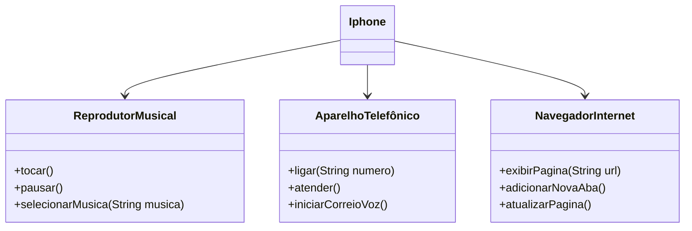

```mermaid
classDiagram
    class ReprodutorMusical{
        +tocar()
        +pausar()
        +selecionarMusica(String musica)
    }

    class AparelhoTelefônico{
        +ligar(String numero)
        +atender()
        +iniciarCorreioVoz()
    }

    class NavegadorInternet{
        +exibirPagina(String url)
        +adicionarNovaAba()
        +atualizarPagina()
    }

    class Iphone{
    }

    Iphone-->ReprodutorMusical
    Iphone-->AparelhoTelefônico
    Iphone-->NavegadorInternet
```
